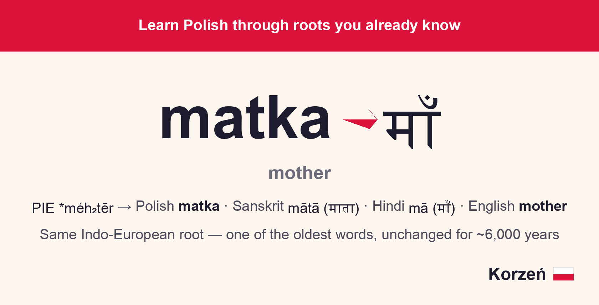

<div align="center">

[](https://sagarlekar.github.io/korzen/)


<p style="font-size: 1.2em; line-height: 1.65; max-width: 42em; margin: 0 auto;">
I know English, Hindi, Konkani, and Marathi — and built Korzeń around a simple idea: Polish shares Indo-European roots with all of them, so pairs like <em>matka</em>/<em>mā</em>, <em>trzy</em>/<em>tīn</em>, and <em>serce</em>/<em>hṛdaya</em> aren’t coincidences. A word sticks deep when it connects to one you already know.
</p>

<br>

<a href="https://sagarlekar.github.io/korzen/">
  
</a>


</div>

## About

**Korzeń** (*root* in Polish) is a simple static flashcard app — flip for meaning, phonetics, examples, and the etymological bridge behind every word. No logins, no backend, no database: progress lives in memory for the current visit and resets on refresh.

## Features

| | |
|---|---|
| 🃏 **Flashcards** | Flip for meaning, phonetics, examples, and etymology |
| 🔄 **Review** | Missed words become multiple-choice drills |
| 🔊 **Audio** | Polish text-to-speech on any card |
| 🌐 **238 words · 13 topics** | Filter by category or study the full deck |
| ⚡ **Static** | Vanilla HTML/JS — no build, backend, or accounts |


Keyboard: `Space` flip · `→` knew it · `←` didn't know

## Categories

👋 Greetings · 🔢 Numbers · 🎨 Colors · 👨‍👩‍👧 Family · 🫀 Body · 🍽️ Food · 🐾 Animals · 🌿 Nature · 🏠 Home · 🏃 Verbs · ✨ Adjectives · 🕐 Time · ✈️ Travel

All vocabulary is in [`data/vocabulary.json`](data/vocabulary.json).

## Make your own

Learning another language? Fork this repo and build your own deck.

1. **Fork** [korzen](https://github.com/sagarlekar/korzen) on GitHub.
2. **Edit [`data/vocabulary.json`](data/vocabulary.json)** — keep the same structure. Each category has an `id`, `name`, `icon`, and `cards`. Each card needs:
   - `polish` — the word in your target language (field name stays as-is)
   - `phonetic`, `english` — pronunciation hint and meaning
   - `example_polish`, `example_english` — a short example sentence
   - `connection` — the etymological bridge to languages you already know
3. **Tweak [`index.html`](index.html)** — title, tagline, flag emoji, and meta tags. If your target language isn't Polish, change the text-to-speech line (`utter.lang = 'pl-PL'`) to your locale (e.g. `'hi-IN'`, `'fr-FR'`).
4. **Test locally** — `fetch` needs a server, not `file://`:
   ```bash
   python3 -m http.server 8080   # → http://localhost:8080
   ```
5. **Deploy** — push to GitHub → **Settings → Pages** → branch `main`, folder `/`. [`.nojekyll`](.nojekyll) is already included.

No build step, no backend. Swap the data, rebrand the shell, host the folder.

## License

MIT — see [LICENSE](LICENSE).
